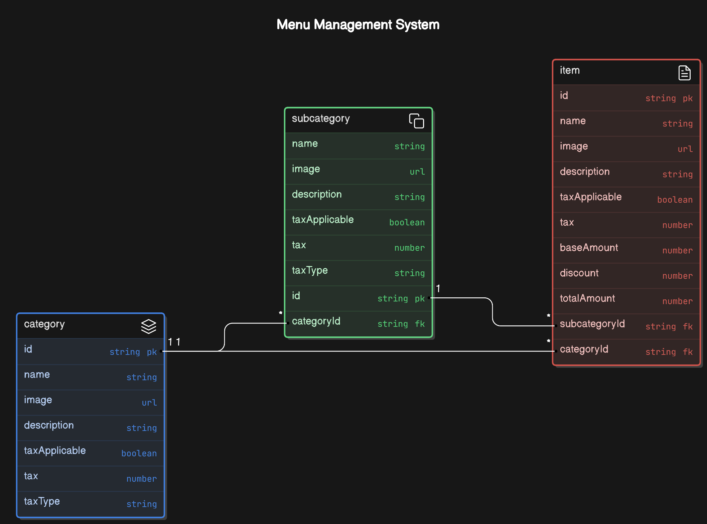

# Menu Management API Backend

This project is a backend server for a Menu Management application, built with Node.js, Express, and MongoDB. It allows users to manage categories, subcategories, and items in a menu, with endpoints for creating, retrieving, updating, searching, and deleting these entities.

## System Architecture



The diagram above illustrates the architecture of the Menu Management system, including the models, their field types, and their relationships.

## Features

- Manage categories, subcategories, and items.
- CRUD operations for all entities.
- Search functionality for items.
- Validation and error handling.

## Installation

1. Clone the repository:

   ```bash
   git clone https://github.com/your-username/menu-management-api.git
   cd menu-management-api
   ```

2. Install dependencies:

   ```bash
   npm install
   ```

3. Configure the database. Create a `config` directory in the root of the project and inside it, create a file named `database.js`. Add your MongoDB connection details in this file:

   ```js
   // config/database.js
   module.exports = {
     url: 'your-mongodb-connection-string'
   };
   ```

4. Start the server:

   ```bash
   npm start
   ```

   The server should now be running on `http://localhost:3000`.

## Usage

Use Postman or any other API client to interact with the endpoints. Below is the list of available endpoints.

## API Endpoints

### Category Endpoints

- **Create a Category**

  ```http
  POST /api/categories
  ```

  **Request Body:**

  ```json
  {
    "name": "Beverages"
  }
  ```

- **Get All Categories**

  ```http
  GET /api/categories
  ```

- **Get a Category by ID**

  ```http
  GET /api/categories/:id
  ```

- **Update a Category**

  ```http
  PUT /api/categories/:id
  ```

  **Request Body:**

  ```json
  {
    "name": "Updated Category Name"
  }
  ```

### Subcategory Endpoints

- **Create a Subcategory**

  ```http
  POST /api/categories/:categoryId/subcategories
  ```

  **Request Body:**

  ```json
  {
    "name": "Soft Drinks"
  }
  ```

- **Get All Subcategories**

  ```http
  GET /api/subcategories
  ```

- **Get Subcategories by Category**

  ```http
  GET /api/categories/:categoryId/subcategories
  ```

- **Get a Subcategory by ID**

  ```http
  GET /api/subcategories/:id
  ```

- **Update a Subcategory**

  ```http
  PUT /api/subcategories/:id
  ```

  **Request Body:**

  ```json
  {
    "name": "Updated Subcategory Name"
  }
  ```

### Item Endpoints

- **Create an Item**

  ```http
  POST /api/subcategories/:subcategoryId/items
  ```

  **Request Body:**

  ```json
  {
    "name": "Coca Cola",
    "image": "path/to/image.jpg",
    "description": "Classic Coca Cola",
    "taxApplicable": true,
    "tax": 5,
    "baseAmount": 2.00,
    "discount": 0.5,
    "totalAmount": 1.50
  }
  ```

- **Get All Items**

  ```http
  GET /api/items
  ```

- **Get Items by Subcategory**

  ```http
  GET /api/subcategories/:subcategoryId/items
  ```

- **Get an Item by ID**

  ```http
  GET /api/items/:id
  ```

- **Update an Item**

  ```http
  PUT /api/items/:id
  ```

  **Request Body:**

  ```json
  {
    "name": "Updated Item Name",
    "description": "Updated Description",
    ...
  }
  ```

- **Search Items**

  ```http
  GET /api/items/search?name=searchTerm
  ```

- **Delete an Item**

  ```http
  DELETE /api/items/:id
  ```

## Example Requests

### Create a Category

```http
POST /api/categories
```

**Request Body:**

```json
{
  "name": "Beverages"
}
```

### Create a Subcategory

```http
POST /api/categories/:categoryId/subcategories
```

**Request Body:**

```json
{
  "name": "Soft Drinks"
}
```

### Create an Item

```http
POST /api/subcategories/:subcategoryId/items
```

**Request Body:**

```json
{
  "name": "Coca Cola",
  "image": "path/to/image.jpg",
  "description": "Classic Coca Cola",
  "taxApplicable": true,
  "tax": 5,
  "baseAmount": 2.00,
  "discount": 0.5,
  "totalAmount": 1.50
}
```

### Search Items

```http
GET /api/items/search?name=Coca
```

### Delete an Item

```http
DELETE /api/items/:id
```
